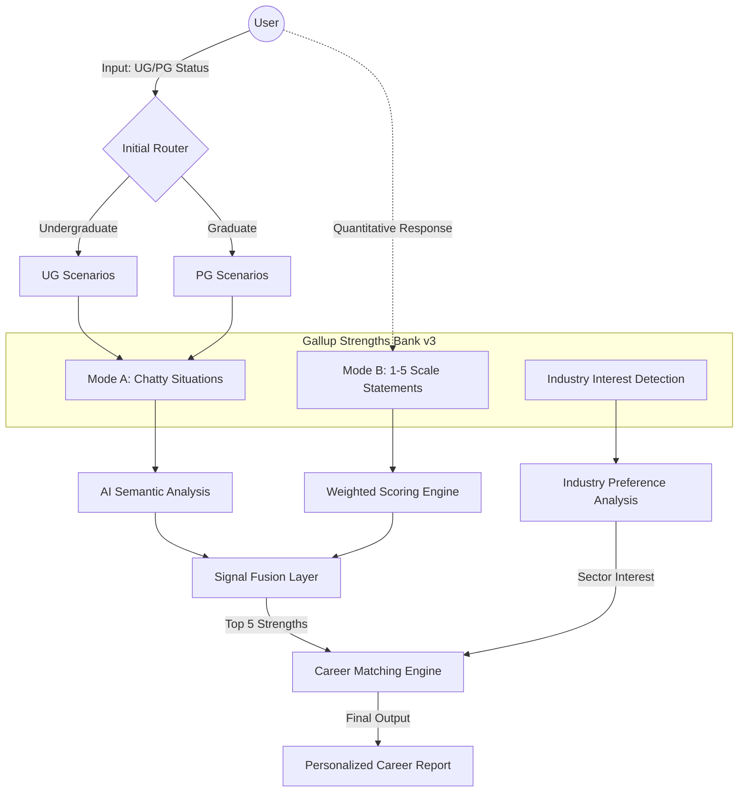

# System Architecture: Gallup CliftonStrengths Guidance System

This document explains how the Question Bank interacts with the AI agent and the end-user.

## 1. System Flow Diagram

## 2. Component Descriptions

### A. Initial Router
Detects user identity (Education level) to trigger the correct situational branching in the Question Bank.

### B. Dual-Mode Question Bank
- **Chatty Mode**: High-empathy, low-pressure conversational probes to bypass self-reporting bias.
- **Scale Mode**: Standardized Likert statements for statistical validation and "hard" data points.

### C. Signal Fusion Layer
Syntheses qualitative "gut feelings" from the chat and quantitative "hard data" from the scales. It prioritizes semantic signals for social-heavy themes (e.g., Empathy) and scale data for productivity-heavy themes (e.g., Focus).

### D. Career Matching Engine
Uses the `matching_principles.md` rules to map the user's High Strength x Industry Interest to specific niche roles (e.g., "Analytical" + "Semiconductor Interest" -> "IC Design").
